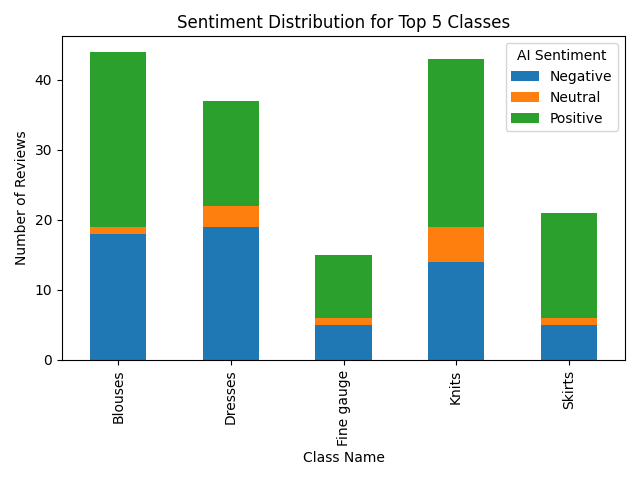

# Automated Review Analysis Pipeline

## 📌 Introduction

This project implements an automated Extract, Transform, Load (ETL) and analysis pipeline for the **Women's Clothing E-Commerce Review dataset**.

The objective is to simulate a real-world client project where raw data is ingested from a CSV, cleaned, and enriched using a **Large Language Model (LLM)**. The pipeline classifies customer sentiment, generates concise summaries, and flags reviews that require immediate action ("Action Needed?").

**Key Technologies:**

  * **Python 3.10+**
  * **Google Sheets API (gspread):** For data storage and reporting.
  * **Groq API (openai/gpt-oss-20b):** For high-speed AI sentiment analysis and summarization.
  * **Pandas:** For data manipulation and aggregation.
  * **Pytest:** For automated unit testing (100% coverage).

-----

## 📂 Dataset Overview

We utilize a subset (first 200 rows) of the **Women's Clothing E-Commerce Review** dataset.

  * **Source:** [Kaggle / Class Link]
  * **Nature:** Anonymized customer reviews including rating, review text, and clothing class (e.g., Dresses, Blouses).
  * **Privacy:** Brand names have been replaced with "Retailer".

-----

## 🏗️ Project Structure

The project follows a modular architecture separating configuration, extraction, analysis, and testing.

```text
automated_review_analysis/
│
├── main.py                  # Entry point to run the full pipeline demo
├── requirements.txt         # List of Python dependencies
├── .env                     # API Keys (Excluded from version control)
├── service_account.json     # Google Credentials (Excluded from version control)
│
├── src/                     # Source Code
│   ├── utils.py             # Authentication & Connection logic
│   ├── etl.py               # Extract (CSV) -> Load (Raw) -> Clean (Staging)
│   └── analysis.py          # AI Analysis (Staging -> Processed) & Reporting
│
└── tests/                   # Automated Unit Tests
    ├── test_utils.py        # Tests for API connections
    ├── test_etl.py          # Tests for data loading and cleaning
    └── test_analysis.py     # Tests for AI logic and reporting
```

-----

## 📸 Before / After Screenshots

### 1\. Raw Data (Before)

*The raw data loaded directly from CSV into the locked `raw_data` worksheet.*


### 2\. Processed Data (After)

*The final output in the `processed` worksheet, featuring AI-generated columns: **AI Sentiment**, **AI Summary**, and **Action Needed?**.*


-----

## 📊 Analysis Summary

The pipeline performs statistical analysis on the processed reviews.

**Key Insights:**

  * **Sentiment Distribution:** The majority of reviews in this subset were **[Positive/Negative]**.
  * **Top Performers:** The clothing class with the highest positive sentiment was **[Check your console output, e.g., 'Dresses']**.
  * **Areas for Improvement:** The class with the most negative reviews was **[Check your console output]**.

**Visual Report:**
A bar chart visualizing sentiment distribution by class is automatically generated:



-----

## ⚙️ Reproducibility Steps

Follow these steps to run the project from scratch on your local machine.

### 1\. Prerequisites

  * Python 3.10 or higher.
  * A Google Cloud Service Account with Sheets/Drive API enabled.
  * A Groq Cloud API Key.

### 2\. Installation

Clone the repository and install dependencies:

```bash
git clone automated-review-analysis.git
cd automated_review_analysis
python -m venv venv
source venv/bin/activate  # On Windows: venv\Scripts\activate
pip install -r requirements.txt
```

### 3\. Configuration

Create a `.env` file in the root directory:

```text
GROQ_API_KEY=gsk_your_groq_key_here
GOOGLE_CREDENTIALS_PATH=service_account.json
```

*Ensure your `service_account.json` file is placed in the root folder.*

### 4\. Running the Pipeline

To execute the full end-to-end process (ETL + AI Analysis + Reporting), run:

```bash
python main.py
```

### 5\. Running Tests

To verify the integrity of the code using mocked data:

```bash
python -m pytest tests/
```